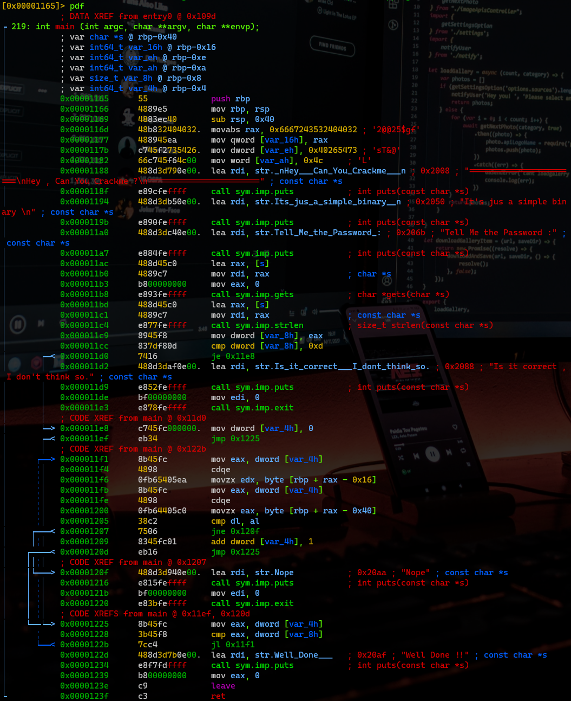

# 0x41hax Writeup

## Information about the CTF
> In this challenge, you are asked to solve a simple reversing solution. Download and analyze the binary to discover the password. There may be anti-reversing measures in place!
> 
> **Question:** What is the password?

## How to solve it
Lets start by running the file command with the ELF executable:  
```console
berkankutuk@kali:~$ file 0x41haz.0x41haz
0x41haz (1).0x41haz: ELF 64-bit MSB *unknown arch 0x3e00* (SYSV)
```

Looks like the header of the ELF file is altered. Lets check it out by running it with hexeditor:  
```console
berkankutuk@kali:~$ hexeditor 0x41haz.0x41haz
00000000 7F 45 4C 46 02 02 01 00 00 00 00 00 00 00 00 00  .ELF............
```

Lets compare this to the [ELF executable header](en.wikipedia.org/wiki/Executable_and_Linkable_Format) which look like this:
```
00000000 7f 45 4c 46 02 01 01 00 00 00 00 00 00 00 00 00 |.ELF............|
```

If we look closely, we see that 0x4 is altered. The value we have in hexeditor says '`02`' where this should be '`01`'.

After this value is changed to '`01`', hit ^X (Exit and save).

Now if we try to run the file command with the executable ELF file again, the output will now look like this:
```console
berkankutuk@kali:~$ file 0x41haz.0x41haz
0x41haz.0x41haz: ELF 64-bit LSB pie executable, x86-64, version 1 (SYSV), dynamically linked, interpreter /lib64/ld-linux-x86-64.so.2, BuildID[sha1]=6c9f2e85b64d4f12b91136ffb8e4c038f1dc6dcd, for GNU/Linux 3.2.0, stripped
```

Now to the fun part. Lets open the executable inside the reverse engineering tool called `radare2` by running
```console
berkankutuk@kali:~$ r2 0x41haz.0x41haz
[0x00001080]>
```

This our file was stripped, we cant use the `aa` command in radare2 in order to do a code analysis. Therefore we will use `aaa`
```console
[0x00001080]> aaa
[x] Analyze all flags starting with sym. and entry0 (aa)
[x] Analyze function calls (aac)
[x] Analyze len bytes of instructions for references (aar)
[x] Finding and parsing C++ vtables (avrr)
[x] Type matching analysis for all functions (aaft)
[x] Propagate noreturn information (aanr)
[x] Use -AA or aaaa to perform additional experimental analysis.
```

Now lets seek the main using '`s main`'
```console
[0x00001080]> s main
```

We can now disassemble the main and printing it out by running:
```console
[0x00001165]> pdf
```
This will give us the following output


We see that dword(A numerical value of twice the magnitude of a word, thus typically 32 bits) is being compared to `0xd` in the memory.
```assembly
0x000011cc      837df80d       cmp dword [var_8h], 0xd
```

At this spot we see this
```assembly
0x0000116d      48b832404032.  movabs rax, 0x6667243532404032 ; '2@@25$gf'
```

A 64 bit string with the value 0x6667243532404032 = [fg$52@@2](https://gchq.github.io/CyberChef/#recipe=From_Hex('Auto')&input=MHg2NjY3MjQzNTMyNDA0MDMy). Since this is in memory, the value shhould be vise versa. 

Which means, `2@@25$gf` we also can see is commented in that line.

The next few lines after this place in memory, we see the rest of the value of the hex.

dword = 32 bit values  
word = 16 bit values

```assembly
0x00001177      488945ea       mov qword [var_16h], rax
0x0000117b      c745f2735426.  mov dword [var_eh], 0x40265473 ; 'sT&@'
0x00001182      66c745f64c00   mov word [var_ah], 0x4c     ; 'L'
```

So we have `2@@25$gf`, `sT&@` and `L`. If we combine these values we get `2@@25$gfsT&@L`.

Lets try this string by running the executable
```console
berkankutuk@kali:~$ ./0x41haz.0x41haz
=======================
Hey , Can You Crackme ?
=======================
It's jus a simple binary

Tell Me the Password :
2@@25$gfsT&@L
Well Done !!
```

And just like that, we found the flag!

_THM{2@@25$gfsT&@L}_