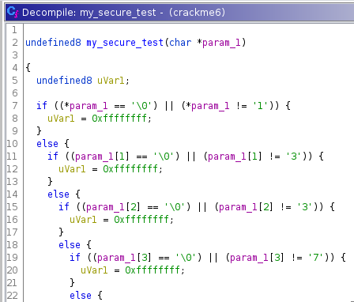
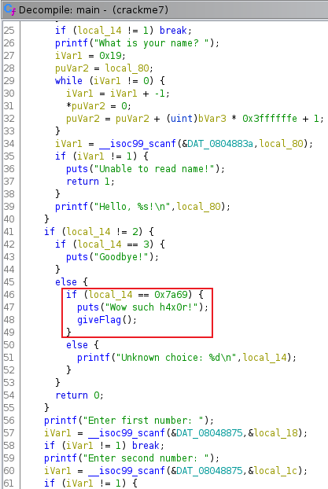

# Reversing ELF writeup
[Link to the CTF on TryHackMe](https://tryhackme.com/room/reverselfiles)

# Information about the CTF
> Room for beginner Reverse Engineering CTF players

# How to solve it
## Task 1) Crackme1
**What is the flag?**

Lets start by analyzing the file with the `file` command
```console
berkankutuk@thm:~$ file crackme1

crackme1: ELF 64-bit LSB executable, x86-64, version 1 (SYSV), dynamically linked, interpreter /lib64/ld-linux-x86-64.so.2, for GNU/Linux 2.6.32, BuildID[sha1]=672f525a7ad3c33f190c060c09b11e9ffd007f34, not stripped
```
Looks fine, lets now make the file executable by using chmod
```console
berkankutuk@thm:~$ chmod +x crackme1
berkankutuk@thm:~$ ./crackme1
flag_is_shown_here
```

## Task 2) Crackme2
**Q) What is the super secret password ?**

Lets try using the `strings` command on the file to see if we are able to get the password.

> The Linux "strings" command makes it possible to view the human-readable characters within any file

```console
berkankutuk@thm:~$ strings crackme2
...
Usage: %s password
password_is_shown_here
Access denied.
Access granted.
...
```
**Q) What is the flag?**
The usage for the crackme2 looks like this:  
`crackme2 <password>`

By inserting the found password, you'll eventually get the flag.
```console
berkankutuk@thm:~$ crackme2 <password>
flag_is_shown_here
```

## Task 3) Crackme3
**Q) What is the flag?**

Try running the strings command with the file
```console
berkankutuk@thm:~$ strings crackme3
...
malloc failed
encoded_message_is_shown_here
Correct password!
...
```
Okay, so we got an base64 encoded string. This can be decoded by pasting the string into this [CyberChef recipe](https://gchq.github.io/CyberChef/#recipe=From_Base64('A-Za-z0-9%2B/%3D',true)).

And by doing that, you should get the flag.

## Task 4) Crackme4
**Q) What is the password?**  

By running the ELF file, we get:

```console
berkankutuk@thm:~$ ./crackme4
Usage : ./crackme4 password
This time the string is hidden and we used strcmp
```
This will tell us that the password is hidden used strcmp

> `strcmp` compares two strings

I then decided to use the `gdb` tool to look more into this.

> gdb stands for GNU Project Debugger and is a powerful debugging tool for C

```console
berkankutuk@thm:~$ gdb crackme4

GNU gdb (Debian 10.1-2) 10.1.90.20210103-git
Copyright (C) 2021 Free Software Foundation, Inc.
License GPLv3+: GNU GPL version 3 or later <http://gnu.org/licenses/gpl.html>
This is free software: you are free to change and redistribute it.
There is NO WARRANTY, to the extent permitted by law.
Type "show copying" and "show warranty" for details.
This GDB was configured as "x86_64-linux-gnu".
Type "show configuration" for configuration details.
For bug reporting instructions, please see:
<https://www.gnu.org/software/gdb/bugs/>.
Find the GDB manual and other documentation resources online at:
    <http://www.gnu.org/software/gdb/documentation/>.

For help, type "help".
Type "apropos word" to search for commands related to "word"...
Reading symbols from crackme4...
(No debugging symbols found in crackme4)
(gdb) >
```

Lets see some information about the fucntions by running:
```console
gdb:~$ info functions
0x00000000004004b0  _init
0x00000000004004e0  puts@plt
0x00000000004004f0  __stack_chk_fail@plt
0x0000000000400500  printf@plt
0x0000000000400510  __libc_start_main@plt
0x0000000000400520  strcmp@plt
0x0000000000400530  __gmon_start__@plt
0x0000000000400540  _start
0x0000000000400570  deregister_tm_clones
0x00000000004005a0  register_tm_clones
0x00000000004005e0  __do_global_dtors_aux
0x0000000000400600  frame_dummy
0x000000000040062d  get_pwd
0x000000000040067a  compare_pwd
0x0000000000400716  main
0x0000000000400760  __libc_csu_init
0x00000000004007d0  __libc_csu_fini
0x00000000004007d4  _fini
```
**This output can be different in your case**

We know that the password is hidden using strcmp, so in this case the `strcmp@plt` function could be interesting. Lets set a breakpoint to the memory location of this function.
```console
gdb:~$ b *0x0000000000400520
Breakpoint 1 at 0x400520
```

Great, now lets run the test
```console
gdb:~$ run test
Starting program: /mnt/c/Users/Berkan/Downloads/crackme4 test

Breakpoint 1, 0x0000000000400520 in strcmp@plt ()
```

Maybe some information from the registers could be valuable. We'll see in a moment
```console
gdb:~$ info registers
(gdb) info registers
rax            0x7fffffffdc10      140737488346128
rbx            0x400760            4196192
rcx            0x11                17
rdx            0x7fffffffdfc0      140737488347072
rsi            0x7fffffffdfc0      140737488347072
rdi            0x7fffffffdc10      140737488346128
rbp            0x7fffffffdc30      0x7fffffffdc30
rsp            0x7fffffffdbf8      0x7fffffffdbf8
r8             0x0                 0
r9             0x7ffff7fdc1f0      140737353990640
r10            0xfffffffffffffb88  -1144
r11            0x7ffff7dff730      140737352038192
r12            0x400540            4195648
r13            0x0                 0
r14            0x0                 0
r15            0x0                 0
rip            0x400520            0x400520 <strcmp@plt>
eflags         0x246               [ PF ZF IF ]
cs             0x33                51
ss             0x2b                43
ds             0x0                 0
es             0x0                 0
fs             0x0                 0
gs             0x0                 0
```
rax and rdx is general purpose registers, so they could provide us valuable information. We should see the string values from these memory locations.

```console
gdb:~$ x/s 0x7fffffffdc10
0x7fffffffdc10: "flag_is_shown here"
```
We found the flag!

## Task 5) Crackme5
**Q) What is the input?**

By running this ELF file, we get:
```console
berkankutuk@thm:~$ 
Enter your input:
test
Always dig deeper
```
I got promted with the "Enter your input" were i decided to input the string "test". This gave me the output "Always dig deeper". Hmm?

Let's do the same as we did in task4, use gdb.
```console
berkankutuk@thm:~$ gdb crackme5
Copyright (C) 2021 Free Software Foundation, Inc.
License GPLv3+: GNU GPL version 3 or later <http://gnu.org/licenses/gpl.html>
This is free software: you are free to change and redistribute it.
There is NO WARRANTY, to the extent permitted by law.
Type "show copying" and "show warranty" for details.
This GDB was configured as "x86_64-linux-gnu".
Type "show configuration" for configuration details.
For bug reporting instructions, please see:
<https://www.gnu.org/software/gdb/bugs/>.
Find the GDB manual and other documentation resources online at:
    <http://www.gnu.org/software/gdb/documentation/>.

For help, type "help".
Type "apropos word" to search for commands related to "word"...
Reading symbols from crackme5...
(No debugging symbols found in crackme5)
gdb >
```
Great, now let us try to list the functions.
```console
gdb:~$ info functions
All defined functions:

Non-debugging symbols:
0x0000000000400528  _init
0x0000000000400560  strncmp@plt
0x0000000000400570  puts@plt
0x0000000000400580  strlen@plt
0x0000000000400590  __stack_chk_fail@plt
0x00000000004005a0  __libc_start_main@plt
0x00000000004005b0  atoi@plt
0x00000000004005c0  __isoc99_scanf@plt
0x00000000004005d0  __gmon_start__@plt
0x00000000004005e0  _start
0x0000000000400610  deregister_tm_clones
0x0000000000400650  register_tm_clones
0x0000000000400690  __do_global_dtors_aux
0x00000000004006b0  frame_dummy
0x00000000004006d6  strcmp_
0x0000000000400773  main
0x000000000040086e  check
0x00000000004008d0  __libc_csu_init
0x0000000000400940  __libc_csu_fini
0x0000000000400944  _fini
```

We can see another comparison function, `strncmp@plt`.

> strncmp compares two numeric characters

I know repeated the process of setting a breakpoint and running the test.
```console
gdb:~$ b *0x0000000000400560
Breakpoint 1 at 0x400560
gdb:~$ run test
Starting program: /mnt/c/Users/Berkan/Downloads/crackme5 test
Enter your input:

```
When asked for the input, I entered "test"
```console
gdb:~$ b *0x0000000000400560
Breakpoint 1 at 0x400560
gdb:~$ run test
Starting program: /mnt/c/Users/Berkan/Downloads/crackme5 test
Enter your input:
test

Breakpoint 1, 0x0000000000400560 in strncmp@plt ()
```

And then ran:
```console
gdb:~$ info registers
(gdb) info registers
rax            0x7fffffffdc00      140737488346112
rbx            0x4                 4
rcx            0x7fffffffdc20      140737488346144
rdx            0x1c                28
rsi            0x7fffffffdc20      140737488346144
rdi            0x7fffffffdc00      140737488346112
rbp            0x7fffffffdbd0      0x7fffffffdbd0
rsp            0x7fffffffdb98      0x7fffffffdb98
r8             0x4                 4
r9             0xffffffffffffff88  -120
r10            0xfffffffffffffb89  -1143
r11            0x7ffff7f37d80      140737353317760
r12            0x4005e0            4195808
r13            0x0                 0
r14            0x0                 0
r15            0x0                 0
rip            0x400560            0x400560 <strncmp@plt>
eflags         0x246               [ PF ZF IF ]
cs             0x33                51
ss             0x2b                43
ds             0x0                 0
es             0x0                 0
fs             0x0                 0
gs             0x0                 0
```
I then looked up the string values for rax and rcx

```console
gdb:~$ x/s 0x7fffffffdc00
0x7fffffffdc00: "test"
```
Okay, so rax had my input. Lets check rcx
```console
gdb:~$ x/s 0x7fffffffdc20
0x7fffffffdc00: "password_is_shown_here"
```
Nice!

## Task 6) Crackme6
**Q) Analyze the binary for the easy password**

We should start by running the ELF executable.
```console
berkankutuk@thm:~$ ./crackme6
Usage : ./crackme6 password
Good luck, read the source
```

Okay. This one is a little tricky, since we will need [Ghidra](https://ghidra-sre.org) for this task.

> Ghidra is a software reverse engineering (SRE) suite of tools developed by NSA's Research Directorate in support of the Cybersecurity mission

Now, create a new project and open the crackme6 file within the project.

Locate the `main` function within the `Symbol Tree` to the left, and click on it.

This will bring up a decompiled version of the main on the right side of your screen.


We see that the input taken for the password is passed to a function called **compare_pwd**. 

Click twice on that function to see its content.  


This function takes the password and passes it to another function called **my_secure_test**. Looking at the source code for this function reveals a block of if else statements that check if each letter in the input corresponds to a specified string value.



Reassembling these specified string values into one string provides the flag (i.e. “1”,“3”,“3”,“7”,etc..).

## Task 7) Crackme7
**Q) Analyze the binary to get the flag**

As always, we should start by running the ELF executable.
```console
berkankutuk@thm:~$ ./crackme7
Menu:

[1] Say hello
[2] Add numbers
[3] Quit

[>]
```
Since we can't really do anything besides adding two numbers, saying hello to ourselves and quitting, we should decompile the binary's source code using Ghidra.

So we create another new project inside Ghidra and open the crackme7 file within the project.

Locate the `main` function within the `Symbol Tree` to the left, and click on it.  


Inside the main function, we see some if-else statements which contains the logic behind the menu we saw earlier. 

If we look closely we see that the input '`0x7a69`' prints "Wow such a h4xor" and then gives us the flag. 

So in order to get the flag, we should get the numeric value of the hex '`0x7a69`'

For this i used this website, [Hexadecimal to Decimal converter](https://www.rapidtables.com/convert/number/hex-to-decimal.html)

By inputting the hex value, i got a numeric value i could try passing when askedd for an option in the menu.

```console
berkankutuk@thm:~$ ./crackme7
Menu:

[1] Say hello
[2] Add numbers
[3] Quit

[>] numeric_value_here
Wow such h4x0r!
flag_is_shown_here
```
Aaand we got the flag.

## Task 8) Crackme8
**Q) Analyze the binary and obtain the flag**

```console
berkankutuk@thm:~$ ./crackme8
Usage: ./crackme8 password

berkankutuk@thm:~$ ./crackme8 test
Access denied.
```
This wasn't to much help, so we should open up Ghidra once again and repeat the process to see the contents of the main function.  


We can see that the access is being granted only if the hex value of `0x35010ff3` is passed.

Therefore, we should copy this value and paste it into the, [Hexadecimal to Decimal converter](https://www.rapidtables.com/convert/number/hex-to-decimal.html).

**Remember there is an "-" icon before the "0x..."**

By getting the negative numeric value, we can now try it as the password.
```console
berkankutuk@thm:~$ crackme8 <password_here>
flag_is_shown_here
```
Congratulations, you did it!